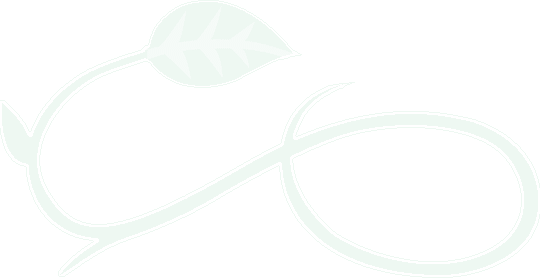

<!DOCTYPE html PUBLIC "-//W3C//DTD XHTML 1.0 Transitional//EN" "http://www.w3.org/TR/xhtml1/DTD/xhtml1-transitional.dtd">
<html xmlns="http://www.w3.org/1999/xhtml">
<head>
<meta name="keywords" content="interior design, space planning, ergonomics, building interiors" />
<title>EGG: Ergonomic, Green, Good</title>

<link rel="stylesheet" type="text/css" href="layout.css" />

<link href="fonts.css" rel="stylesheet" type="text/css" />

<!--[if lte IE 6]>
	
<![endif]-->

<!--[if IE]>

<![endif]-->

<link href="SpryAssets/SpryMenuBarHorizontal.css" rel="stylesheet" type="text/css" />

</head>

<body>

<!-- 1. Branding -->

<h1>EGG Commercial Building Habitats</h1></a>

<!-- 2. Sidebar content -->
	

    <h3> A BETTER BOTTOM LINE</h3>

EGG creates a positive impact on employee health, productivity, retention and morale – and helps reduce building operations costs.

    

    <!-- 3. Main content -->
    

    
    <!--Top Nav-->
<ul id="MenuBar1" class="MenuBarHorizontal">
  <li><a href="TheEGGWay.html">The EGG Way</a>
  </li>
  <li><a class="MenuBarItemSubmenu" a href="Services.html">Services</a>
  <ul>
    	<li><a href="ATotalGreenBuilding.html">A Total Green Building Recommendation</a></li>
    </ul>
  </li>
  <li><a class="MenuBarItemSubmenu" href="AboutUs.html">About Us</a>
  	<ul>
    	<li><a href="Client_testimonials.html">Client Experience & Testimonials</a></li>
    </ul>
  </li>
  <li><a a class="MenuBarItemSubmenu" href="Facts&resources.html">Facts &amp; Resources</a>
  	<ul>
        <li><a href="WhyBuildGreen.html">Why build green?</a></li>
        <li><a href="TheEconomics.html">The economics of ergonomics</a></li>
        </ul>
  <li><a href="Contactus.html">Contact Us</a></li>
</ul>
    
<h2>Ergonomic, Green, Good</h2>
   
We plan commercial interior spaces using ergonomic, aesthetic and sustainable principles to enhance your employee and workspace assets.

From simple improvements to gutted interiors and blank-canvas plans, we can help you improve the look and feel of your workspace, improve employee performance and reduce operating costs.

<h3>
Office Design   |   Building Layout   |   Space Planning</h3>

    
    

    
    

       
    

©2009 EGG Commercial Building Habitats | <a href="mailto:jrhadley@ergogreengood.com">contact us</a>

</body>
</html>
